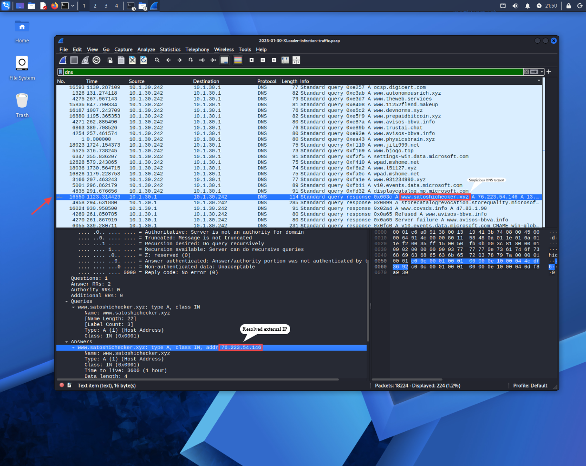
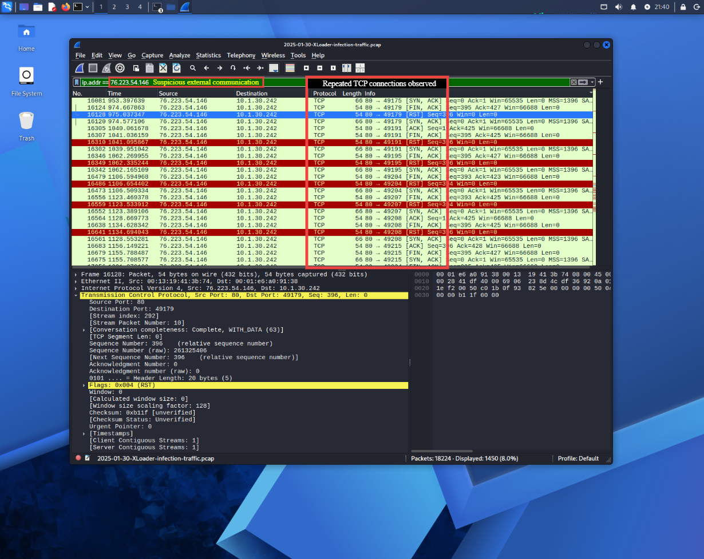
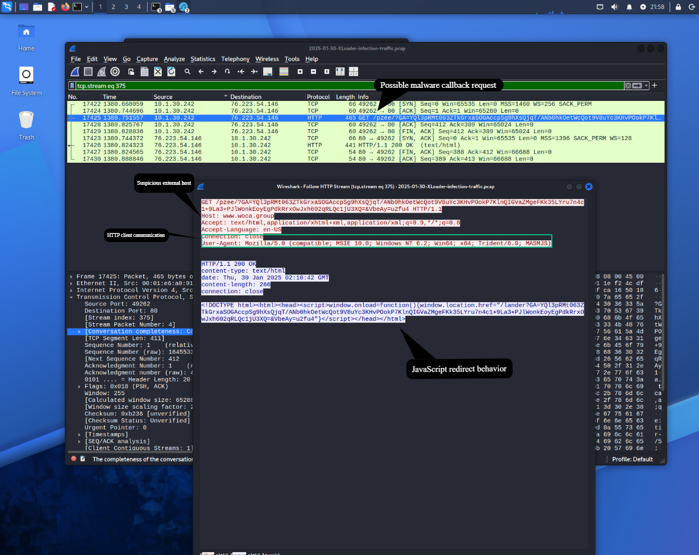

# SOC Threat Detection Lab

A hands-on Blue Team project focused on malware traffic analysis, IOC investigation, and network threat detection using Wireshark and Python

---

# Objectives

- Analyze suspicious network traffic
- Investigate Indicators of Compromise (IOCs)
- Practice SOC investigation workflow
- Improve traffic analysis and incident response skills
- Document findings professionally

---

# Tools & Technologies

- Wireshark
- Python
- Kali Linux

---

# Project Structure

```text
soc-threat-detection-lab/
│
├── pcap/
├── reports/
├── screenshots/
├── scripts/
└── iocs/
```

---

# Features

- PCAP traffic investigation
- IOC extraction
- DNS and HTTP traffic analysis
- Malware communication analysis
- SOC-style incident reporting

---

# Investigation Case

## XLoader Malware Traffic Analysis

This investigation focused on analyzing suspicious network traffic associated with an XLoader malware infection

### Findings

- Suspicious DNS requests
- Malicious domains identified
- HTTP callback traffic detected
- Encoded GET requests observed
- Suspicious redirect behavior

---

# Screenshots

## Suspicious DNS Resolution



---

## External TCP Communication



---

## HTTP Stream Analysis



---

# Learning Goals

This project was created to improve practical Blue Team skills, threat detection capabilities, and SOC investigation methodologies in a controlled lab environment

---

# Status

Project in progress
